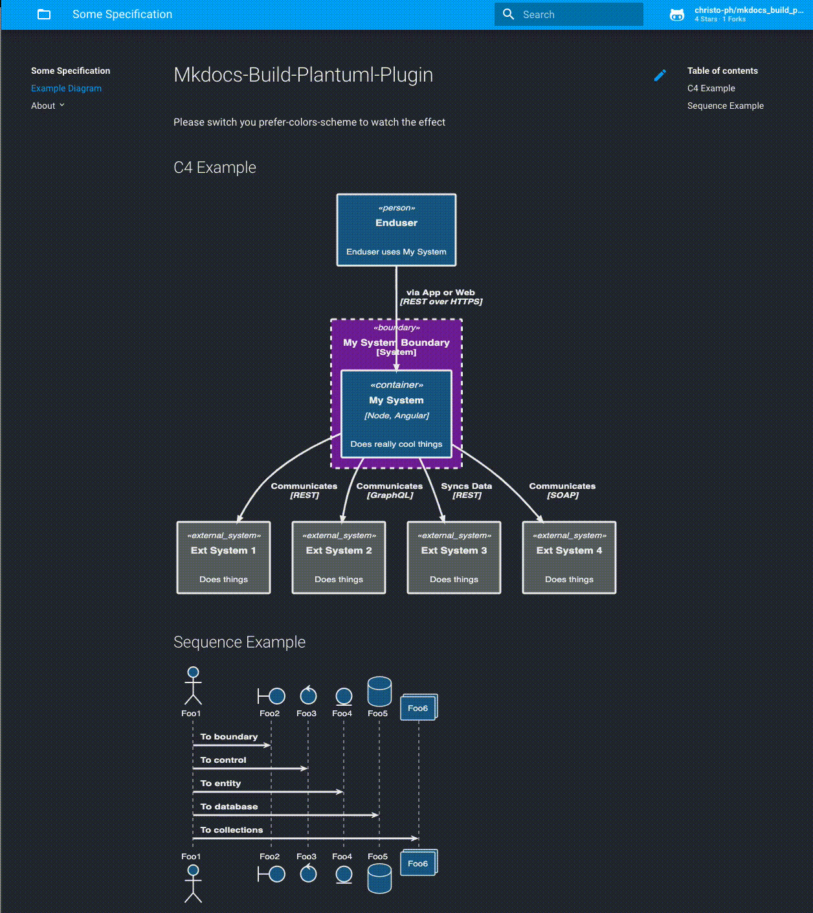

# MkDocs-Build-Plantuml-Plugin

## Table of Contents

- [About the Project](#about-the-project)
- [Prerequisites](#prerequisites)
- [Installation](#installation)
- [Usage](#usage)
- [Dark Mode Support](#dark-mode-support)
- [Known restrictions](#known-restrictions)
- [Changelog](#changelog)
- [Contributing](#contributing)

## About the Project

This plugin automates the generation of PlantUML image files when using `mkdocs serve`.

The motivation behind this plugin is to provide a solution for users who prefer not to use inline diagrams and have encountered challenges with non-functional !includes.

**Note**: If you want inline diagrams in your Markdown files

````markdown
```plantuml
Alice -> Bob
```
````

this plugin does _not_ meet your requirements. Please check out [plantuml-markdown](https://github.com/mikitex70/plantuml-markdown) which does exactly that.

## Prerequisites

You need to have installed:

- Python3 (>= 3.12)
- [MkDocs](https://www.mkdocs.org)
- Java for Plantuml (If running locally)
- [Plantuml](https://plantuml.com) (if running locally)
- This plugin (needs [httplib2](https://pypi.org/project/httplib2/) for server rendering)

On macOS you can install plantuml with homebrew which puts a plantuml executable in `/usr/local/bin/plantuml`.

## Installation

```shell
pip3 install mkdocs-build-plantuml-plugin
```

## Usage

### Plugin Settings

In `mkdocs.yml` add this plugin section (depicted are the default values):

```yaml
plugins:
  - search
  - build_plantuml:
      render: 'server' # or "local" for local rendering
      bin_path: '/usr/local/bin/plantuml' # ignored when render: server, default plantuml from PATH
      server: 'http://www.plantuml.com/plantuml' # official plantuml server
      disable_ssl_certificate_validation: true # for self-signed and invalid certs
      output_format: 'svg' # or "png"
      allow_multiple_roots: false # in case your codebase contains more locations for diagrams (all ending in diagram_root)
      diagram_root: 'docs/diagrams' # should reside under docs_dir
      output_folder: 'out'
      input_folder: 'src'
      input_extensions: '' # comma separated list of extensions to parse, by default every file is parsed
```

It is recommended to use the `server` option, which is much faster than `local`.

### Example folder structure

This would result in this directory layout:

```python
docs/                         # the default MkDocs docs_dir directory
  diagrams/
    include/                  # for include files like theme.puml etc (optional, won't be generated)
    out/                      # the generated images, which can be included in your md files
      subdir1/file1.svg       # you can organise your diagrams in subfolders, see below
      file.svg
    src/                      # the Plantuml sources
      subdir1/file1.puml
      subdir2/
      file.puml
mkdocs.yml                    # mkdocs configuration file

```

When starting with `mkdocs serve`, it will create all diagrams initially.

Afterwards, it checks if the `*.puml` (or other ending) file has a newer timestamp than the corresponding file in out. If so, it will generate a new image (works also with includes). This way, it won‘t take long until the site reloads and does not get into a loop.

### Including generated images

Inside your `index.md` or any other Markdown file you can then reference any created image as usual:

```markdown
# My MkDocs Document

## Example Plantuml Images


```

## Dark Mode Support

Since Version 1.4 this plugin can support dark mode when rendering with `server`.

**Note**: Dark mode / theme support is only available in server rendering mode, not local.

### Setup for MkDocs Material 9.x

1. Configure the Material theme with a palette toggle in `mkdocs.yml`:

    ```yaml
    theme:
      name: material
      palette:
        - scheme: default
          toggle:
            icon: material/brightness-7
            name: Switch to dark mode
        - scheme: slate
          toggle:
            icon: material/brightness-4
            name: Switch to light mode
    ```

2. Enable theme support in this plugin:

    ```yaml
    plugins:
      - build_plantuml:
          render: "server"
          theme_enabled: true
          theme_folder: "include/themes"
          theme_light: "light.puml"
          theme_dark: "dark.puml"
    ```

3. Create two PlantUML theme files (e.g., `light.puml` and `dark.puml`) with appropriate colors and `skinparam backgroundColor transparent` for proper dark mode display.

4. In the `out` directory, both `<file>.<ext>` and `<file>_dark.<ext>` will be generated.

5. Reference images in markdown with the `#darkable` suffix:

    ```markdown
    
    ```

6. Add JavaScript to swap images on theme toggle ([example](./example/docs/javascript/images_dark.js)):

    ```yaml
    extra_javascript:
      - javascript/images_dark.js
    ```

    The JS uses a MutationObserver to watch for changes to `data-md-color-scheme` attribute and swaps `_dark` image variants accordingly.

7. Optionally add CSS for dark mode styling using `[data-md-color-scheme="slate"]` selector ([example](./example/docs/stylesheets/theme_dark.css)).

See the [example folder](./example/) for a complete working setup.

### Example Output



## Known restrictions

- If you use `!include` and the `render: "server"` option, this plugin merges those files manually. If there are any issues or side effects because of that, please open a ticket.
- Dark mode / theme support is currently only available in server rendering mode.

## Changelog

See [CHANGELOG.md](./CHANGELOG.md) for version history and breaking changes.

## Contributing

Contributions are welcome! If you find any issues or have suggestions for improvements, please open an issue or submit a pull request.

### Running Tests

```bash
pip install -e ".[test]"
pytest tests/ -v                           # All tests
pytest tests/ --ignore=tests/test_integration.py  # Unit tests only
pytest tests/test_integration.py -v        # Integration tests (requires network)
```
